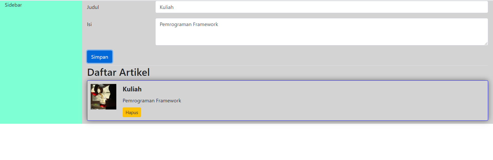

# Jawaban Pertanyaan Pertemuan 5
## Praktikum 1
a. 
1. berikut adalah tampilan setelah mengganti nama class
</img>
2. perbedaan container dan container-fluid adalah dari lebar layoutnya, jika menggunakan container-fluid maka lebar layoutnya akan memenuhi browser jika menggunakan container maka sebaliknya.
   
b.
1. Menginstall module package seperti 'npm' dan Melakukan import sesuai dengan komponen yang diinginkan. Contoh "import { Button } from 'react-bootstrap';"

## Praktikum 2
a.
1. Karena setiap port hanya dapat menjalankan satu proses
2. Json-server tidak dapat dijalankan karena port 3000 merupakan default dari react

## Praktikum 3
1. Ketika di klik data tersebut akan terhapus
2. Pada file listArtikel.json ketika data dihapus di file tersebut juga ikut terhapus
3. Fungsi handleHapusArtikel adalah melakukan handle hapus data sesuai dengan parameter "id" menggunakan method "DELETE"
4. Sumber API yang digunakan berbeda. Yang pertama mengambil dari jsonplaceholder, sedangkan yang kedua berada di local 

## Praktikum 4
1. listArtikel.json akan otomatis menambah datanya jika ada data baru yang diinputkan pada form
2. Karena data yang di fetch di order secara descending sehingga data terbaru akan berada diatas.
   